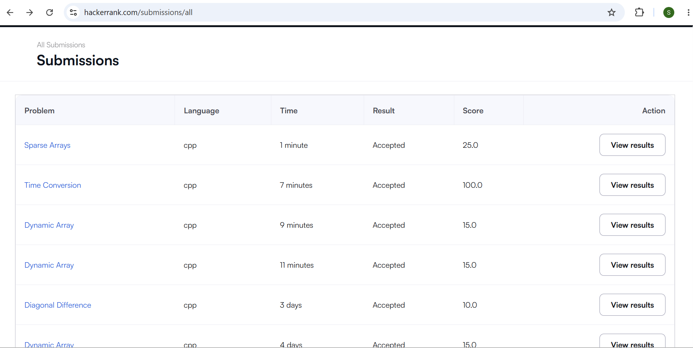

# HackerRank 3rd Semester Portfolio

## About

This repository contains my solutions to the five mandatory HackerRank problems completed as part of the Portfolio Building course.

The solutions focus on basic problem-solving concepts, arrays, strings, data structures, and efficient algorithms.

## HackerRank Profile

HackerRank Profile: ** https://www.hackerrank.com/profile/niveditahallad**

## Problems Solved

| No. | Problem              | Topic                     | Time Complexity | Space Complexity |
| --- | -------------------- | ------------------------- | --------------- | ---------------- |
| 1   | Diagonal Difference  | 2D Arrays / Matrices      | O(N)            | O(1)             |
| 2   | Dynamic Array        | Data Structures / Vectors | O(N + Q)        | O(N)             |
| 3   | Time Conversion      | Strings / Logic           | O(1)            | O(1)             |
| 4   | Compare the Triplets | Basic Implementation      | O(1)            | O(1)             |
| 5   | Sparse Arrays        | Hash Maps / Strings       | O(N + Q)        | O(N)             |

## Repository Structure

```text
HackerRank-3rdSem-Portfolio/
│
├── Diagonal-Difference/
│   └── solution.cpp
│
├── Dynamic-Array/
│   └── solution.cpp
│
├── Time-Conversion/
│   └── solution.cpp
│
├── Compare-the-Triplets/
│   └── solution.cpp
│
└── Sparse-Arrays/
    └── solution.cpp
```

## HackerRank Screenshots

### HackerRank Profile


### Accepted Submissions


